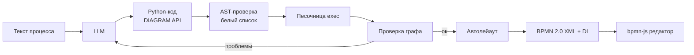

# BPMN- Архитектор

ИИ-помощник, который превращает **текстовое описание бизнес-процесса** в **BPMN 2.0 диаграмму**: участники (дорожки), действия, ветвления (XOR / AND / OR), возвраты и подпроцессы. Результат сразу открывается и редактируется в браузере (bpmn-js, тот же движок, что в [bpmn.io](https://bpmn.io)) и скачивается как `.bpmn`.

Проект сделан для полуфинала хакатона «ИИ-ассистенты для энергетики».

## Возможности

- Ввод процесса обычным текстом на русском языке
- Автоматическое определение участников → **пул и дорожки (swimlanes)**
- Типы задач: пользовательская (`userTask`), автоматическая (`scriptTask`), обычная (`task`)
- Шлюзы: **исключающий** (XOR), **параллельный** (AND), **включающий** (OR) с корректным слиянием
- Циклы (возврат на доработку), подпроцессы, группы
- Автоматическая раскладка элементов, читаемая схема без ручной расстановки
- Экспорт в **BPMN 2.0 XML с BPMNDI** (геометрия), совместимый с bpmn.io
- Редактор диаграммы прямо в приложении + скачивание правленой версии
- Замена LLM без правок кода: любой OpenAI-совместимый endpoint

## Как это работает



1. **Генерация.** Модель получает системный промпт с описанием API, правилами трактовки текста и примером (few-shot) и возвращает Python-код.
2. **Безопасность.** Код разбирается через `ast`: запрещены `import`, функции, классы, циклы `while`, dunder-имена, любые методы кроме `DIAGRAM.*`. Выполнение идёт с урезанными `__builtins__`.
3. **Проверка результата.** Анализируется граф: все узлы достижимы от старта и ведут к концу, шлюзы действительно ветвят или сливают потоки. Найденные проблемы возвращаются модели для исправления (по умолчанию до 2 попыток).
4. **Сборка.** Собственная реализация `DIAGRAM` строит модель, раскладывает её по дорожкам и колонкам и сериализует в BPMN 2.0 XML с диаграммой интерчейнджа.

Такой подход выбран вместо прямой генерации XML: модель оперирует небольшим понятным API, а валидность XML и геометрия обеспечиваются программно.

## Структура репозитория

| Файл | Назначение |
|---|---|
| `app.py` | Streamlit-интерфейс, встроенный редактор bpmn-js |
| `pipeline.py` | Промпт, вызов LLM, AST-валидация, песочница, цикл самоисправления |
| `bpmn_diagram.py` | Реализация `DIAGRAM` API, проверки графа, автолейаут, экспорт XML/DI |
| `requirements.txt` | Зависимости |
| `.env.example` | Шаблон конфигурации |

## Быстрый старт

Требуется Python 3.10+.

```bash
git clone <URL-репозитория>
cd <папка>
python -m venv .venv
source .venv/bin/activate          # Windows: .venv\Scripts\activate
pip install -r requirements.txt

cp .env.example .env               # впишите свой ключ
streamlit run app.py
```

Приложение откроется на `http://localhost:8501`.

## Конфигурация

Параметры берутся из переменных окружения, `.env` или `.streamlit/secrets.toml` и могут быть изменены в боковой панели.

| Переменная | Описание | Пример |
|---|---|---|
| `LLM_BASE_URL` | OpenAI-совместимый endpoint | `https://router.huggingface.co/v1` |
| `LLM_MODEL` | Идентификатор модели | `Qwen/Qwen3.6-35B-A3B` |
| `LLM_API_KEY` | Ключ доступа | `hf_...` |

Для смены модели (gpt-oss-120b, модели Яндекса и др.) достаточно изменить эти три значения. Основной сценарий не зависит от конкретной модели.

> ⚠️ Никогда не коммитьте ключи в репозиторий. Добавьте `.env` в `.gitignore`.
> Если ключ когда-либо попадал в код или ноутбук, отзовите его и выпустите новый.

## Выгрузка в интернет через Cloudflare

Запуск для внешнего доступа:

```bash
streamlit run app.py --server.port 8501 --server.headless true \
  --server.enableCORS false --server.enableXsrfProtection false
```

**Быстрый вариант** (временный адрес `https://*.trycloudflare.com`):

```bash
cloudflared tunnel --url http://localhost:8501
```

**Постоянный адрес на своём домене:**

```bash
cloudflared tunnel login
cloudflared tunnel create bpmn-app
cloudflared tunnel route dns bpmn-app bpmn.example.com
```

`~/.cloudflared/config.yml`:

```yaml
tunnel: bpmn-app
credentials-file: ~/.cloudflared/<UUID>.json
ingress:
  - hostname: bpmn.example.com
    service: http://localhost:8501
  - service: http_status:404
```

```bash
cloudflared tunnel run bpmn-app
```

Streamlit использует WebSocket, Cloudflare проксирует его без дополнительной настройки. Так как боковая панель видна всем посетителям, ключ LLM лучше задавать через окружение или secrets и ограничить доступ к туннелю (например, через Cloudflare Access).

## Пример

**Вход:**

> Клиент оставляет заявку. Менеджер получает заявку и проверяет её. Если заявка корректная, менеджер согласует договор. Если некорректная, отправляет клиенту на доработку. Клиент исправляет заявку и повторно отправляет её. После согласования договора система автоматически регистрирует договор.

**Код, который генерирует модель:**

```python
pool_id, lanes = DIAGRAM.add_pool(ROOT_PROCESS_ID, ["Клиент", "Менеджер", "Система"])
client, manager, system = lanes
t1 = DIAGRAM.add_user_task("Подать заявку", client)
t2 = DIAGRAM.add_user_task("Проверить заявку", manager)
g1 = DIAGRAM.add_exclusive_gateway("Заявка корректна?", manager)
t3 = DIAGRAM.add_user_task("Согласовать договор", manager)
t4 = DIAGRAM.add_user_task("Доработать заявку", client)
t5 = DIAGRAM.add_script_task("Зарегистрировать договор", system)
DIAGRAM.add_link(ROOT_START_TASK_ID, t1)
DIAGRAM.add_link(t1, t2)
DIAGRAM.add_link(t2, g1)
DIAGRAM.add_link(g1, t3)
DIAGRAM.add_link(g1, t4)
DIAGRAM.add_link(t4, t2)
DIAGRAM.add_link(t3, t5)
DIAGRAM.add_link(t5, ROOT_END_TASK_ID)
```

**Результат:** файл `.bpmn` с тремя дорожками, исключающим шлюзом и петлёй возврата на доработку, который открывается в bpmn.io через *File → Open*.

## DIAGRAM API

| Метод | Что создаёт |
|---|---|
| `add_pool(container, lane_names)` | Пул и дорожки, возвращает `(pool_id, [lane_id, ...])` |
| `add_task(name, container)` | Обычная задача |
| `add_user_task(name, container)` | Задача человека |
| `add_script_task(name, container)` | Автоматическая задача системы |
| `create_subprocess(name, container)` | Раскрытый подпроцесс |
| `add_exclusive_gateway(name, container)` | XOR-шлюз |
| `add_parallel_gateway(name, container)` | AND-шлюз |
| `add_inclusive_gateway(name, container)` | OR-шлюз |
| `add_group(name, container)` | Группа |
| `add_link(parent_id, child_id)` | Поток управления |

`container` — это `ROOT_PROCESS_ID`, id дорожки, подпроцесса или группы. Стартовое и конечное события заданы заранее: `ROOT_START_TASK_ID`, `ROOT_END_TASK_ID`.

## Ограничения

- Условия переходов отражаются в названии шлюза (API хакатона не принимает условия в `add_link`). Метод `add_link` в этой реализации дополнительно принимает необязательный `label` для подписи стрелки.
- Раскладка послойная и простая; на очень больших схемах возможны пересечения линий. Результат можно поправить в редакторе.
- Поддерживается один пул (несколько дорожек). Сообщения между пулами (Message Flow) и события-границы не реализованы.
- Для работы встроенного редактора браузеру нужен доступ к `unpkg.com` (bpmn-js). Для закрытого контура разместите библиотеку локально.
- Качество разбора зависит от модели и чёткости исходного описания.

## План развития

- [ ] Двухэтапная генерация: извлечение сущностей в JSON, затем сборка
- [ ] Валидация XML по `BPMN20.xsd` из спецификации 2.0.2
- [ ] Подписи условий на исходящих стрелках шлюзов
- [ ] Несколько пулов и Message Flow
- [ ] Пошаговое редактирование диаграммы текстовыми командами

## Ссылки

- [Спецификация BPMN 2.0.2 (OMG)](https://www.omg.org/spec/BPMN/2.0.2/)
- [bpmn.io](https://bpmn.io) · [bpmn-js](https://github.com/bpmn-io/bpmn-js)
- [Streamlit](https://streamlit.io) · [Cloudflare Tunnel](https://developers.cloudflare.com/cloudflare-one/connections/connect-networks/)
